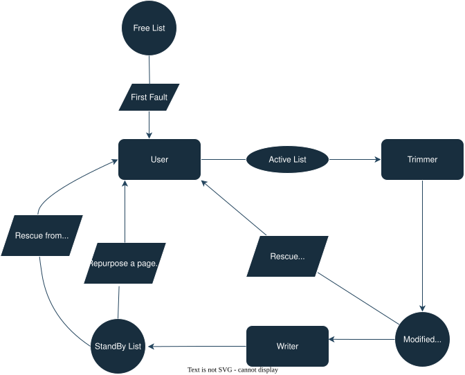
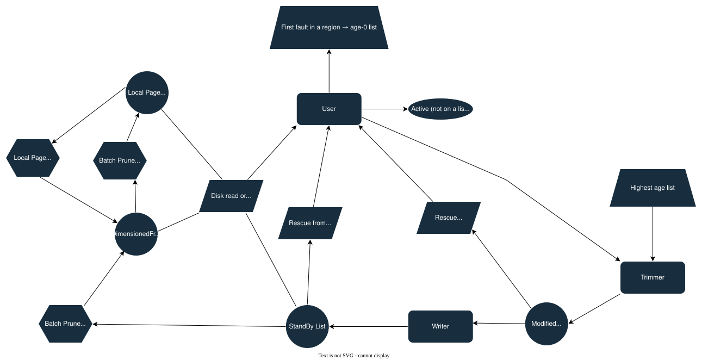
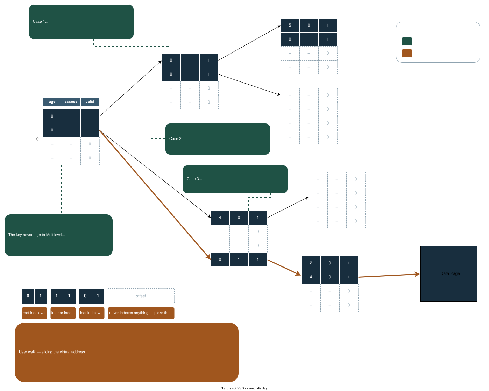

## **By Noah Persily**

### **Summer/Fall 2025 — Reach out with questions at *nrpersily@gmail.com***

## **The Goal**

The goal of this program is to simulate the memory manager in the Windows OS. I reserve a large portion of virtual address space, but I do not back it with physical memory. Then, in a loop, I simulate access to the user VA space. Because the space is not committed, page faults are generated. Once I get a page fault it is the program's duty to map a page as quickly as possible. The core loop of the program is that pages are mapped to virtual space, then once we are out of pages, we unmap them and write their contents out to disk. Once that virtual address is re-accessed, the contents are read back in from the disk.

## **Roadmap**

### **Single Threaded State Machine**

I started this journey by making a single threaded virtual memory manager. The main focus was to use the Windows APIs effectively and to understand the moving parts of the state machine. The key primitives used in this implementation were page table entries (PTEs), page frame numbers (PFNs), linked lists, and disk metadata.

A PTE is a 64-bit code that corresponds to a page of virtual space. In the PTE, 40 bits are dedicated to storing the physical frame number and the other 24 bits are mine to use. I use exactly 40 bits because the address bus line in a computer is only 52 bits wide, and since each PTE maps to a page, I do not need the lower 12 bits to get the offset within the page (2^52 / 2^12 = 2^40). Of the 24 other bits, the most relevant is the valid bit, which says whether the virtual space is backed by physical memory. In a real operating system, a page is mapped and unmapped by setting and clearing that bit. When the PTE is invalid, the 40 bits that hold a frame number store a disk index instead, so when that PTE is faulted on, the program knows where to go to retrieve the contents of the virtual memory.

A PFN is a data structure that contains information about exactly one physical page of memory. At first, the struct had three fields: the actual frame number, the corresponding PTE, and a Windows ListEntry struct which is just two pointers. For my final single threaded design, I removed the frame number field because I realized I could use a sparse array to get the frame number in constant time.

At the start, I had two lists of PFNs: an active list which represents pages with valid PTEs and a free list which contains free pages. An advantage of an active list is that it keeps pages automatically sorted by age, so it is always possible to find the oldest page in constant time.

To simulate a disk, I allocated a large portion of memory. The disk region has two pieces of metadata that inform the program where to find free disk slots: a bytemap and a count for the number of free disk slots in a region. The bytemap tracks whether a slot is free for a page of data that needs to be written to disk. The disk is split into arbitrarily-sized regions, and the counts inform the program which region has the most free disk space.

With all these structures, we can create a program that manages page faults. When a virtual address is faulted on, it is translated into its PTE which should have a cleared valid bit. Then, the program checks the page lists. First, the program checks the free list to see if there is any physical memory not in use. Then it gets a page off of the active list. The contents of the page are written to disk and the victim PTE's valid bit is cleared. The faulting PTE's contents are then read onto the physical page and the valid bit is set.

### **Basic Multithreaded Machine**

Now that I was very familiar with the moving parts of this state machine, I had to figure out what parts to separate into their own threads. Initially, I only thought about having a user thread and a trimmer/writer thread, but performance traces showed that both writing and trimming were costly, so I decided to split them into their own threads.

A new challenge in the multithreaded world was PTEs in transition between threads. I needed to create two new page lists, modified and standby. The modified list contains pages that have been unmapped from their virtual addresses, but not yet written to disk. The standby list contains pages that have contents in both a disk slot and the physical page. Since the pages on these lists still hold the contents of the virtual page, we can save ourselves from doing a disk read by mapping that specific frame if the previous virtual address is faulted on again. I use the term "rescue" to describe this sequence of events. Additionally, I had to use one more of the 24 status bits to mark a PTE as in-transition, and one more bit in the PFN to encode which list the page was on (modified or standby). If a page is on standby, it can be repurposed for a new PTE as long as the PTE that currently maps to the page has its transition bit cleared.

Another new consideration was a lock hierarchy. In this simple multithreaded state machine I only had three types of locks: page table entry locks, list locks, and disk locks. Since I need to look at a PTE to determine which list to go to, PTEs sit at the top of my hierarchy. Disk locks are self-contained, so they are acquired last.

This order made sense, but there were a few cases where I had to break it. When repurposing a page off the standby list, I first need to look at the standby list and then edit the PTE of the page at the head. I cannot lock the PTE first because I need to examine the standby list to determine which PTE to target, and I cannot lock them out of order because that could cause a deadlock. To solve this, I try to acquire the PTE lock and if I cannot, I release the standby lock and redo the fault.

*The page lists and the transitions between them, once trimming and writing became their own threads.*

### **Complex Multithreaded State Machine**

To achieve better scalability, I implemented sophisticated locking techniques and optimizations across multiple areas.

#### **Fine-Grained Disk Management**

I replaced the single disk lock with per-slot atomic interlocked operations and switched from a bytemap to a bitmap representation. This eliminated disk contention as a bottleneck and allowed multiple threads to allocate disk slots simultaneously.

#### **Advanced List Management with Page Locks**

To reduce list contention, particularly on the standby list, I implemented embedded locks within each PFN and added slim read-write locks to list head structures. This allows concurrent operations — removing from head, adding to tail, and removing from the middle — simultaneously. The page locks also serve as substitutes for PTE locks when a PTE is linked to a PFN, reducing overall lock contention.

#### **Batching Optimizations**

I implemented batching across all thread types to amortize system call costs. The trimmer removes multiple pages from the active list and unmaps them with a single function call. The writer pre-acquires multiple disk slots and performs batched disk operations. If there are not enough pages on the modified list, the program frees the extra disk slots.

User threads batch unmap operations on kernel virtual address space and batch transfers from standby to free lists and from free lists to local caches.

#### **Multidimensioned Free Lists**

To eliminate rather than just move contention, I partitioned the free list across multiple instances. Unlike the standby list where ordering matters for aging, the free list can be safely split, allowing multiple user threads to satisfy faults without interfering with each other.

#### **Complex Aging Model and PTE Regions**

I implemented a multi-level page aging system that exploits the non-random nature of real-world memory access patterns. PTEs are grouped into regions, and regions are placed on one of several age lists based on how recently their entries have been accessed. The ager scans PTEs, checks a hardware-style access bit, and promotes or demotes regions between age buckets accordingly. The trimmer preferentially evicts pages from the oldest regions, leveraging temporal locality: pages accessed recently are likely to be accessed again soon, while untouched pages are good eviction candidates.

Grouping PTEs into regions rather than tracking individual PTEs amortizes the overhead of aging: one region lock covers many PTEs, and the trimmer can skip entire regions with no active entries.

At this stage the page table was one flat array, so a region was an arbitrary slice of it. Going multilevel changed what a region *is* and gave the ager a much cheaper way to walk them, which is described below.

#### **Local Caches**

Each user thread maintains local caches of pages to minimize lock contention. With local caches, user threads only need to acquire PTE locks (which are unavoidable for correctness) and can operate on cached pages without additional synchronization overhead. This dramatically reduces the frequency of expensive list operations. The trimmer intelligently targets pages from local caches during memory pressure, as it is preferable to reclaim a page that has not yet been mapped to a virtual address rather than evicting an actively used page from the working set.

#### **Trimmer Signaling**

The trimmer now signals the writer after the first batch is complete so they run concurrently. The trimmer will likely always be slightly faster than the writer because it does not have read and write from disk. Once the trimmer has built up enough of an initial batch, the writer can start and likely will run out of work. 

#### **Adaptive Scheduler Thread**

I added a dedicated scheduler thread that wakes up periodically and decides how much work to dispatch to the ager, trimmer, and writer threads each cycle. Rather than waking these threads with fixed work targets, the scheduler observes each thread's recent throughput (pages processed per unit time) and the current rate of page consumption across user threads.

The scheduler solves a timing problem: aging must complete before trimming and writing can produce free pages. Given the measured rates and an estimate of how long until the system runs out of available pages, the scheduler computes the minimum amount of aging needed this cycle and dispatches just that much — avoiding both under-aging and over-aging . A short calibration phase at startup collects baseline throughput data before the adaptive logic engages. 

*Where a data page goes once all of the above is in play.*

### **Multilevel Page Tables**

#### **Why Multilevel**

A flat page table has to exist in full before a single virtual address can be translated. One PTE per page of virtual space means the table scales with the address space I reserve, not with the amount I actually touch — reserving 512 GB would cost a gigabyte of page table sitting permanently in physical memory, nearly all of it mapping addresses that are never accessed.

A multilevel table fixes this by making page tables themselves ordinary pages. A page table is one 4 KB page holding 512 PTEs, pointed at by a single PTE one layer up. Nine bits of the virtual address index each layer, so `L` layers reserve 512^L pages of virtual space and only the branches actually faulted on need to exist. Everything the manager already knew how to do to a page — map, unmap, age, trim, write to disk — now applies to page tables too, because they are just pages that happen to hold PTEs.

The layer count is a config parameter, defaulting to 3 (512 GB of reservable VA), and the same 64-bit PTE format is reused at every layer. A branch PTE's 40 frame-number bits hold the frame of its child page table instead of a data page, and the valid, access, transition, and age bits mean exactly the same thing one layer up as they do at the leaf.

#### **The Faulting Walk**

A fault now descends the tree instead of indexing into it. At each layer I parse the nine relevant bits of the virtual address, and if that PTE is invalid I run the ordinary fault path on it — which materializes a page table rather than a data page for every layer but the last. The descent is hand-over-hand: I set the lock bit on the current PTE before releasing the parent's, so nothing above me can be trimmed out from underneath while I am still walking down. The root is guarded by its own critical section since every fault must pass through that single entry, and it is never trimmed. One user fault can now cost several page materializations instead of one; the run report tracks that distribution, which is the honest price of the tree.

The other new piece of bookkeeping is a count on the PFN of every page table page: how many of its 512 PTEs are currently valid or in transition. It is incremented when a fault materializes a child underneath it and decremented when that child goes away. A page table can only be reclaimed once that count hits zero — a transition entry counts because pages on the modified and standby lists carry back-pointers to their owning PTE, and the writer and the repurpose path follow those pointers directly without walking the tree and without any ability to fault. Trimming a page table with transition entries in it would unmap the exact memory those threads are about to write into. The same counter is also what lets the ager skip work.

*Orange is the user's walk, green is the ager. Each PTE is drawn as its age, access, and valid fields, and the tables hold four entries instead of 512 so the whole tree fits. The three green cases are the aging protocol described below.*

#### **Lock Order Follows the Tree**

With a flat table, all PTE locks were peers: one layer, never two PTE locks held at once, and the only ordering rule that mattered was the coarse one — PTE, then list, then disk.

A tree adds an ordering *within* the PTE tier. A parent's lock must always be taken before its child's, because a thread holding a child while reaching upward could meet a thread descending from that parent and neither would move. Ranking PTEs by layer — higher over lower — prevents that, and the natural direction of travel already obeys it: the fault path descends hand-over-hand from the root, the ager combs downward, and the trimmer holds a region's lock (which lives in the parent PTE) before touching any of the 512 children inside it.

The one operation that genuinely needs to go the other way is the fault path bumping the parent page table's valid/transition count after materializing a child. It resolves this by not taking the parent's *PTE* lock at all: it takes the page lock embedded in the parent page table's PFN instead. That is a different lock on a different object, so reaching upward for it does not invert the PTE ordering — the upward step was moved off the ordered tier entirely rather than being granted an exception.

#### **Aging Protocol**

The ager no longer sweeps a flat array. It combs the tree iteratively rather than recursively — current layer, page table, and row are loop state, so there is no call stack to pay for. At every PTE it visits, one of four things happens:

- **Invalid.** Nothing to age; move on.
- **Valid and unaccessed.** Age it in place with a single interlocked compare-exchange and do *not* descend. This is the whole point of the tree. Because the fault path and the simulated hardware access-bit setter both set the access bit at *every* layer on the way down, a parent with a clear access bit means nothing anywhere in its subtree has been touched since the last pass. Aging the parent therefore stands in for aging everything beneath it: one compare-exchange ages up to 512^(layers below) leaf PTEs worth of address space. Because the parent's age changed, its child page table's region moves to the matching age list.
- **Valid, accessed, one layer above the leaves.** Age the leaf page table entry by entry, then rescan it to find its new age and re-list it.
- **Valid, accessed, interior.** Take the child page table's page lock and read its valid/transition count — the page lock is what protects the count, since it only changes on a fault or a repurpose, both of which hold it. A nonzero count means something is live below and I descend. A zero count means the entire subtree is empty and the access bit no longer stands for anything reachable, so I clear it in place with a compare-exchange, list the region at age zero if it is not already on a list, and skip the descent entirely. Clearing off the counter rather than off a scan is what makes the prune cheap: one counter read stands in for 512 PTE reads per table, for however many tables hang below.

The report breaks the comb down per layer into leaf / pruned / descended / aged-in-place and estimates how many PTEs the pruning skipped, so I can see whether the tree is paying for itself at a given layer count.

A region is now exactly one page table page — 512 PTEs, one lock, one entry on one of the eight age lists. A region's age is no longer maintained incrementally in per-region counters; it is derived by scanning for the highest age among its valid PTEs, with a sentinel for a region that has none. Deriving it costs a scan but removes an entire class of counter-drift bugs, and the scan short-circuits as soon as it sees a max-age entry.

The locking follows the tree's shape: a region's lock is the lock bit of the PTE one layer up, the PTE that points at that page table. The thing that protects a page table is stored in its parent — exactly the PTE you already had in hand to get there.

#### **How This Shifted the Access Pattern**

The test's access pattern had to change with the tree, in two ways.

**Locality became necessary rather than optional.** The original test picked uniformly at random across the whole address space. Under a flat table that was fine — every fault cost the same, and the age lists carried almost no signal because a uniform-random workload has no temporal locality to exploit. Under a tree it is close to a worst case: every fault lands in a different branch, so nearly every fault pays the full materialization cost down the tree, access bits are set everywhere, and the ager can neither prune nor age in place. The tree's entire advantage is that most of it stays untouched, and uniform-random guarantees the opposite.

So the walk is now sequential with a jump: within a page it advances by one word, and at each page boundary it moves to the next page with probability 0.9 and jumps to a uniformly random address with probability 0.1, yielding runs averaging ten consecutive pages. Since a leaf page table covers 512 consecutive pages, a run almost always stays inside a single leaf region, and often several runs land in the same one. Hot branches end up a small minority of the tree, the ager ages the cold majority in place at the interior layers without ever descending, and the trimmer's victims arrive as contiguous batches under one region lock.

**The accessible window is now smaller than the reserved space.** With three layers the reserved VA is 512 GB, far more than physical memory plus disk can back. Reserving it is free; touching it is not. So the config computes what is actually commitable — physical pages plus disk pages, minus the transfer and zero slots, minus a reservation for every frame the page table tree could ever need, since page tables are physical-backed and never paged to disk — and clamps the access generator to that window rather than to the reserved range.

This is why the reserved address space and the accessed address space are now two different numbers in the run report. The tree is what makes reserving far more than I can back cheap; the clamp is what keeps the test from writing a check the disk cannot cash.

## **Current Focus: Decommitting Memory**

*As of August 2026*

